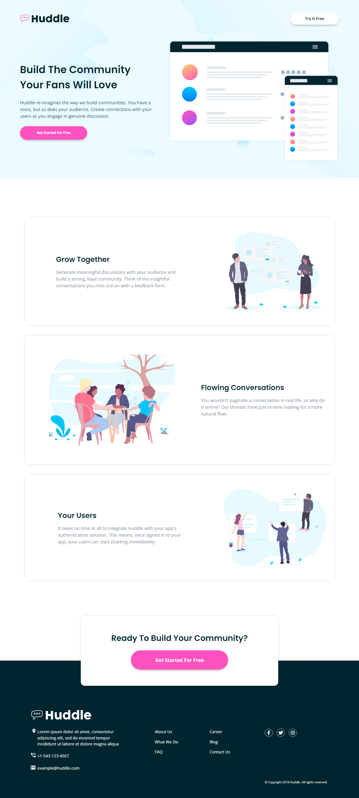

# Frontend Mentor - Huddle landing page with alternating feature blocks solution

This is a solution to the [Huddle landing page with alternating feature blocks challenge on Frontend Mentor](https://www.frontendmentor.io/challenges/huddle-landing-page-with-alternating-feature-blocks-5ca5f5981e82137ec91a5100). Frontend Mentor challenges help you improve your coding skills by building realistic projects. 

## Table of contents

- [Overview](#overview)
  - [The challenge](#the-challenge)
  - [Screenshot](#screenshot)
  - [Links](#links)
- [My process](#my-process)
  - [Built with](#built-with)
  - [What I learned](#what-i-learned)
  - [Continued development](#continued-development)
  - [Useful resources](#useful-resources)
- [Author](#author)
- [Acknowledgments](#acknowledgments)

## Overview

### The challenge

Users should be able to:

- View the optimal layout for the site depending on their device's screen size
- See hover states for all interactive elements on the page

### Screenshot



### Links

- Solution URL: [Solution](https://github.com/JustANipple/huddle-landing-page-with-alternating-feature-blocks/blob/master/style.css)
- Live Site URL: [Live site](https://justanipple.github.io/huddle-landing-page-with-alternating-feature-blocks/)

## My process

### Built with

- Semantic HTML5 markup
- CSS custom properties
- Flexbox
- CSS Grid
- Mobile-first workflow
- Link line animation
- Josh's Custom CSS Reset

### What I learned

I wanted to give the footer links a bit of animation, so i found a guide to make a line appear from the bottom center of a link to the end of the link words

This is what i used to make it


```css
.links a:hover {
  position: relative;
}

.links a::before {
  content: "";
  position: absolute;
  display: block;
  width: 100%;
  height: 2px;
  bottom: 0;
  left: 0;
  background-color: white;
  transform: scaleX(0);
  transition: transform 0.3s ease;
}

a:hover::before {
  transform: scaleX(1);
}
```

### Continued development

Spacing and positioning is still a trial and error for me, because i just use a margin/padding and then see if it matches the design. I don't know if this is the right way to implement a website, so i'll try to improve using more integer units instead of lots of decimal ones

### Useful resources

- [Link underline animation](https://tobiasahlin.com/blog/css-trick-animating-link-underlines/) - With this website i managed to create a good looking link animation for the footer links

## Author

- Frontend Mentor - [@JustANipple](https://www.frontendmentor.io/profile/JustANipple)

## Acknowledgments

Thanks to Tobias Ahlin for making a well explained page for the links animation!
